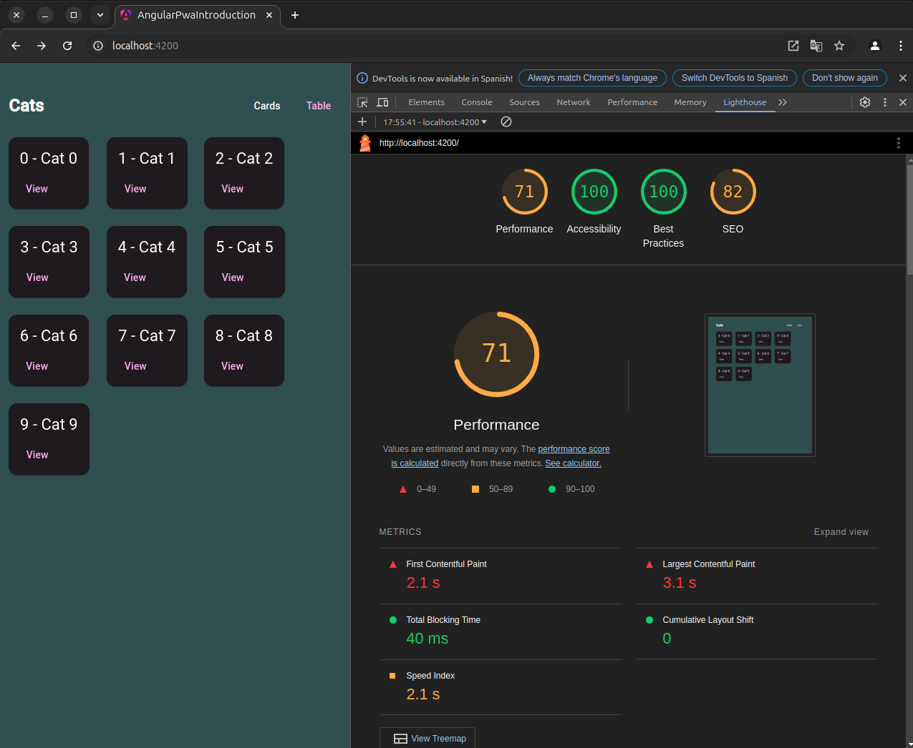

# Ejercicio 1

## Capturas de pantalla:




## Comentarios básicos

### **Análisis de Lighthouse en mi aplicación Angular**

Durante la auditoría de mi aplicación Angular utilizando Google Lighthouse, obtuve los siguientes resultados:

- **Performance**: 71
- **Accessibility**: 100
- **Best Practices**: 82
- **SEO**: 71

Aunque la accesibilidad y las mejores prácticas están en buenos niveles, el rendimiento y el SEO necesitan optimizaciones.

#### **Métricas clave de rendimiento**

- **First Contentful Paint (FCP)**: 2.1 s
- **Largest Contentful Paint (LCP)**: 3.1 s
- **Total Blocking Time (TBT)**: 40 ms
- **Cumulative Layout Shift (CLS)**: 0
- **Speed Index (SI)**: 2.1 s

Estas métricas muestran que el tiempo de renderizado inicial y el contenido más grande visible podrían ser más rápidos. Aunque el CLS es perfecto y el TBT es excelente, el LCP idealmente debería ser menor a 2.5 s.

#### **Diagnósticos y mejoras sugeridas**

1. **Habilitar compresión de texto**:
   - Lighthouse identificó un ahorro potencial de **2,575 KiB**. Para resolver esto, puedo configurar compresión con gzip o Brotli en el servidor de la aplicación.

2. **Minificar JavaScript**:
   - Con una posible mejora de **1,076 KiB**, sería importante asegurarme de que el proyecto Angular utiliza minificación en producción. Esto se configura en el archivo `angular.json` dentro del bloque de producción:
    
     ```json
     "configurations": {
       "production": {
         "optimization": true,
         "sourceMap": false
       }
     }
     ```

3. **Reducir JavaScript no utilizado**:
   - Ahorros posibles: **1,212 KiB**. Este ajuste requerirá una revisión de los módulos y dependencias que se cargan en la aplicación para eliminar código innecesario.

4. **Eliminar recursos que bloquean el renderizado**:
   - Lighthouse identificó un ahorro de **240 ms** si reduzco el impacto de archivos CSS y JS en el renderizado inicial. Para solucionar esto, puedo implementar técnicas como **carga diferida** (lazy loading) o usar etiquetas `<link rel="preload">` para recursos críticos.

5. **Optimización del SEO**:
   - Mejorar el SEO requiere agregar etiquetas meta esenciales, descripciones completas y verificar que todas las imágenes tengan atributos `alt` adecuados.

#### **Conclusión**

Los resultados muestran un buen punto de partida, especialmente en accesibilidad, pero también áreas clave donde puedo mejorar el rendimiento y el SEO. Al implementar compresión de texto, minificación y optimizaciones en la carga de recursos, espero mejorar significativamente las métricas de rendimiento y el puntaje general de Lighthouse.

## Decisiones de diseño en la configuración del Service Worker

1. **Estrategia de Cache First para recursos estáticos**:
   - Se ha utilizado la estrategia `Cache First` para recursos estáticos como imágenes, CSS y JavaScript. Esto permite que la aplicación cargue rápidamente estos recursos desde la caché, mejorando el rendimiento y la experiencia del usuario.

2. **Estrategia de Network First para datos dinámicos**:
   - Para las solicitudes de datos dinámicos, como las respuestas de la API, se ha implementado la estrategia `Network First`. Esto asegura que los datos más recientes se obtengan de la red, pero si la red no está disponible, se utilizarán los datos en caché.

3. **Precaching de recursos críticos**:
   - Se ha configurado el precaching de recursos críticos durante la instalación del service worker. Esto garantiza que los recursos esenciales estén disponibles sin conexión desde el primer momento.

4. **Actualización del Service Worker**:
   - Se ha implementado una lógica para manejar la actualización del service worker. Cuando hay una nueva versión del service worker, se notifica al usuario y se le da la opción de actualizar la aplicación para obtener las últimas mejoras y correcciones.

5. **Manejo de eventos de sincronización en segundo plano**:
   - Se ha configurado el service worker para manejar eventos de sincronización en segundo plano. Esto permite que las acciones del usuario, como enviar formularios, se completen incluso si la conexión a Internet se pierde temporalmente.

6. **Notificaciones push**:
   - Se ha añadido soporte para notificaciones push, permitiendo a la aplicación enviar notificaciones a los usuarios incluso cuando la aplicación no está activa.

Estas decisiones de diseño aseguran que la aplicación sea rápida, confiable y funcione sin problemas tanto en línea como fuera de línea.
